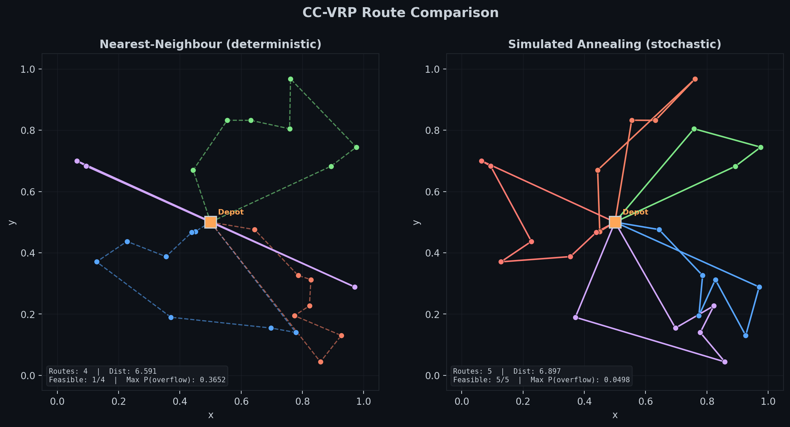
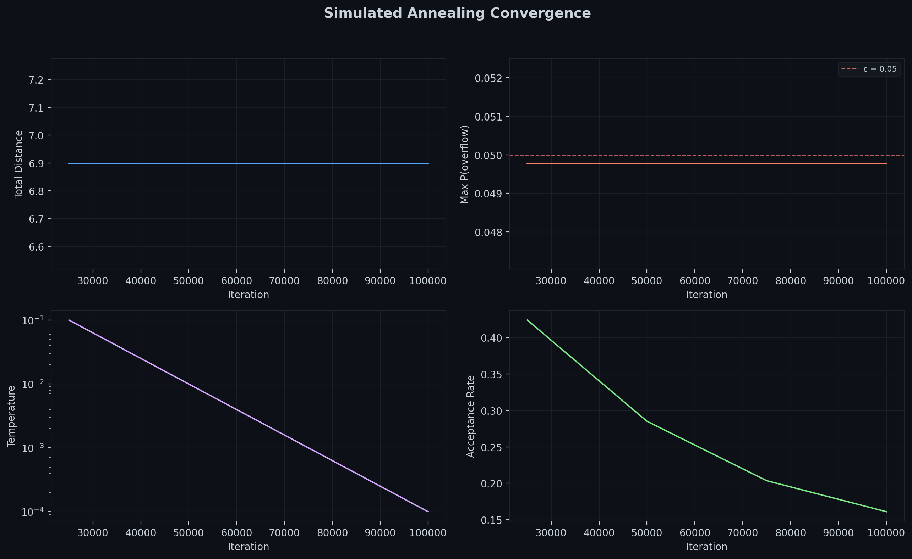
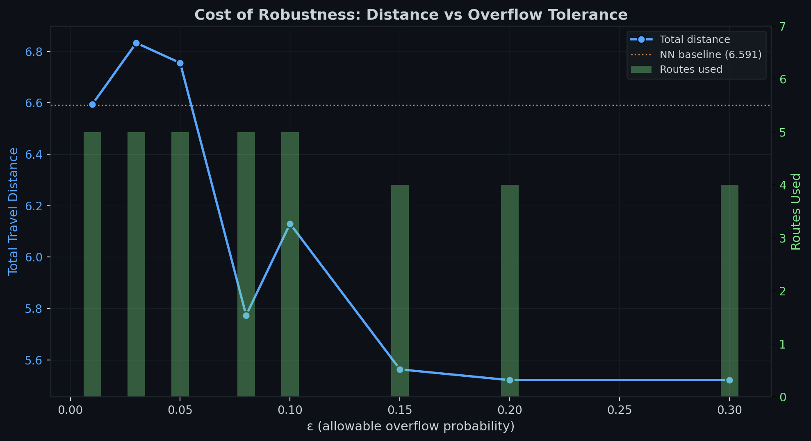
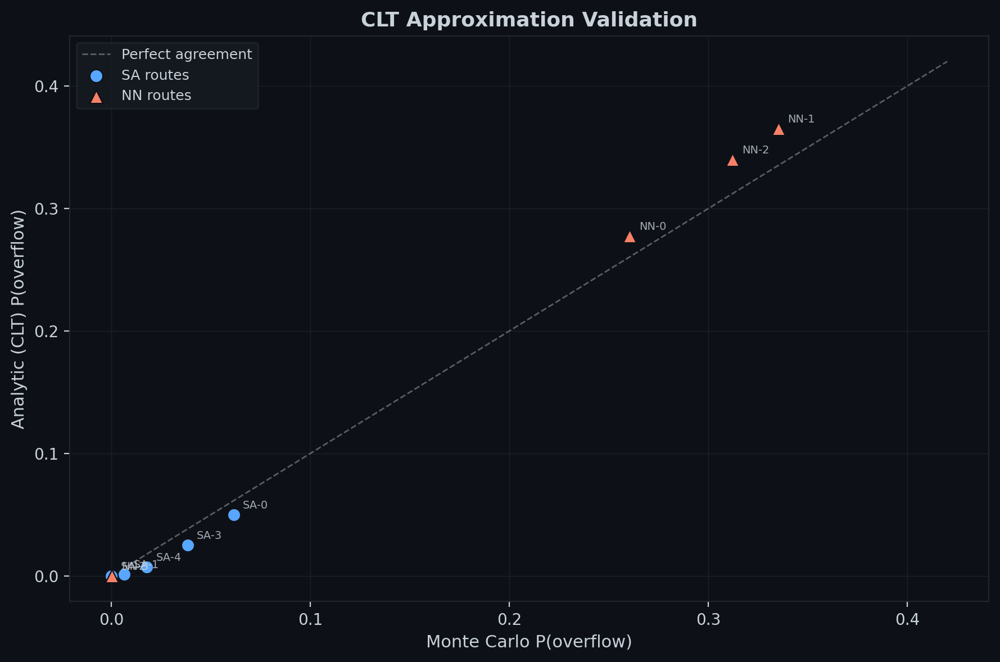
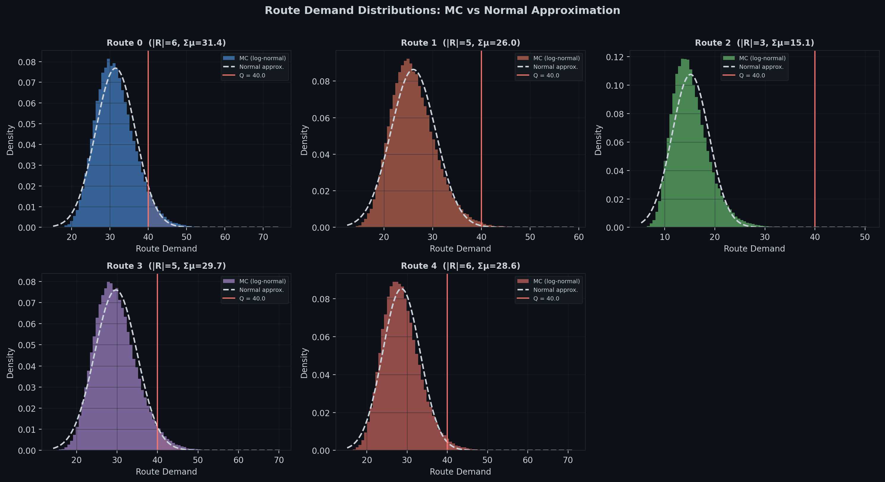
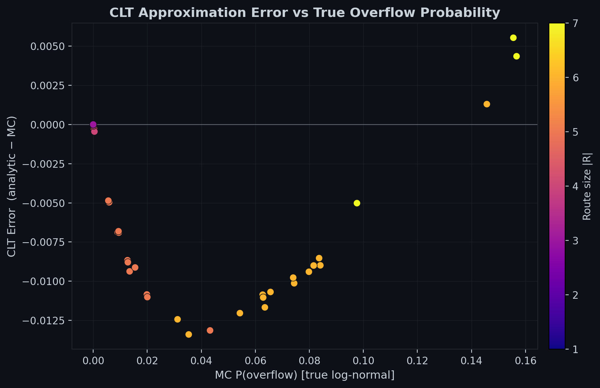

# Chance-Constrained Vehicle Routing under Stochastic Demand

**Project 4** of a data science portfolio. A depot dispatches vehicles to serve customers with uncertain demand. We solve for minimum-distance routes subject to a probabilistic capacity constraint using simulated annealing, then quantify the cost of robustness.

<p align="center">
  
</p>

## Problem

A fleet of *K* vehicles, each with capacity *Q*, serves *N* customers from a central depot on [0,1]². Each customer *i* has stochastic demand

$$d_i \sim \text{LogNormal}(\mu_i^{\ln},\; \sigma_i^{\ln\,2})$$

parameterised so that the marginal mean and coefficient of variation match specified targets (CV ∈ [0.3, 0.5]). The log-normal is chosen over the Gaussian because demands are non-negative and right-skewed.

We minimise total travel distance subject to a **chance constraint** on each route *R*:

$$\mathbb{P}\!\left(\sum_{j \in R} d_j > Q\right) \leq \varepsilon$$

Under independence, the CLT gives a deterministic equivalent:

$$\sum_{j \in R} \mu_j \;+\; \Phi^{-1}(1-\varepsilon)\,\sqrt{\sum_{j \in R} \sigma_j^2} \;\leq\; Q$$

This closed-form expression is evaluated in O(|R|) time and used inside the solver's inner loop. A Monte Carlo path using the true log-normal model validates the approximation post hoc.

## Architecture

```
instance_generator.py    Problem instances, demand model, chance-constraint evaluation
sa_solver.py             Simulated annealing with adaptive penalty
analysis.py              All figures and numerical experiments
```

**Instance generator.** Customers are placed uniformly on the unit square. Mean demands and CVs are drawn from configurable ranges. The module provides two evaluation paths: a fast analytic path (Normal CDF) for the solver, and a Monte Carlo path (true log-normal sampling) for validation.

**SA solver.** Three neighbourhood operators — Or-opt (customer relocation), intra-route 2-opt (segment reversal), and cross-exchange (tail-segment swap) — are selected stochastically. The chance constraint enters as an adaptive penalty: λ increases when the best solution is infeasible and decreases when feasible, avoiding manual tuning.

**Analysis.** Runs the solver across a grid of ε values to trace the cost-vs-robustness trade-off, validates the CLT approximation against Monte Carlo, and compares the stochastic solution to a deterministic nearest-neighbour baseline.

## Results

### The cost of ignoring uncertainty

The nearest-neighbour baseline routes on mean demands achieve distance **6.59** but violate the chance constraint on **3 of 4 routes** (max overflow probability 37%). The SA solver finds a feasible solution at distance **6.90** — a +4.7% cost to bring overflow risk from 37% down to 5%.

### Convergence

<p align="center">
  
</p>

The solver reaches feasibility within ~25k iterations, then spends the remaining budget improving distance. The adaptive penalty drives λ to the floor once a feasible solution is found. Acceptance rate decays from ~42% to ~16%, indicating healthy cooling.

### Cost-vs-robustness trade-off

<p align="center">
  
</p>

Sweeping ε from 0.01 to 0.30 reveals a ~16% distance reduction as overflow tolerance increases from 1% to 20%. The ε = 0.20 and ε = 0.30 solutions collapse — the solver found a distance-optimal configuration that satisfies both. Non-monotonicity at ε = 0.10 reflects SA landing in different local optima under different penalty landscapes, an honest artefact of metaheuristic search.

### CLT approximation quality

<p align="center">
  
</p>

The Normal approximation is consistently optimistic: it underestimates overflow probability because the log-normal's right tail is heavier than the Gaussian's. The bias is small for low-overflow routes (SA solutions) and grows to ~3 percentage points for the heavily-loaded NN routes. This validates using the analytic path for the solver while auditing final solutions with Monte Carlo.

<p align="center">
  
</p>

Per-route demand histograms (true log-normal MC) overlaid with the Normal approximation. The right-skew is visible on all routes. The capacity line Q = 40 shows how much probability mass sits in the overflow region.

<p align="center">
  
</p>

CLT error (analytic − MC) plotted against true overflow probability, coloured by route size. The approximation is tightest for large routes (stronger CLT) and low overflow (far from the tail). Errors are bounded within ±3 pp across the full ε sweep.

## Reproducing

```bash
python instance_generator.py   # smoke test: instance + baseline + constraint audit
python sa_solver.py             # smoke test: full SA run with improvement report
python analysis.py              # generate all figures → figures/
```

Requires Python 3.10+, NumPy, SciPy, Matplotlib. No other dependencies.

## Design decisions

**Why log-normal demands?** Gaussian demands can go negative, which is unphysical for quantities. The log-normal preserves the CLT-based deterministic equivalent (which operates on means and variances) while giving a more realistic generative model for Monte Carlo validation.

**Why adaptive penalty instead of hard constraint?** Hard constraint handling in SA requires feasibility-preserving moves, which severely restricts the neighbourhood and slows convergence. The adaptive penalty lets the solver explore infeasible regions early (when temperature is high) and tighten toward feasibility as it cools.

**Why three move operators?** Or-opt rebalances load between routes. 2-opt improves within-route distance. Cross-exchange enables large structural changes that neither Or-opt nor 2-opt can reach alone. The combination covers both fine-grained and coarse-grained moves.

**Why not exact methods?** The CC-VRP is NP-hard; branch-and-cut approaches scale to ~50 customers in the literature. SA is pragmatic for portfolio purposes: it demonstrates understanding of the problem structure while producing interpretable solutions. The two-path evaluation design (fast analytic + thorough MC) would transfer directly to an exact solver's subproblem evaluation.

## Portfolio context

| # | Project | Methods |
|---|---------|---------|
| 1 | Causal inference — Fed rates → VIX | IV / 2SLS |
| 2 | MLOps pipeline — demand forecasting | LightGBM, GCP |
| 3 | Bayesian adaptive clinical trial | Gompertz SDE, Beta-Binomial MCMC, Thompson sampling |
| **4** | **CC-VRP (this project)** | **Simulated annealing, chance constraints, Monte Carlo validation** |


## Author

Jesse Koivu — Pure mathematics PhD, transitioning to data science.
This project is part of a portfolio demonstrating Stochastic optimization.

[[LinkedIn](https://www.linkedin.com/in/jesse-koivu-b3b0a72b5/)] · [[GitHub](https://github.com/JesseK37)]

